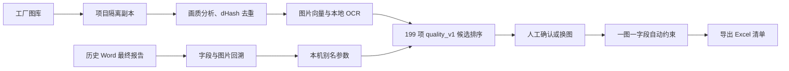

# AutoPick 项目进度与更新日志

> 当前版本：`v0.3.0`（固定 Excel 清单与本地反馈闭环）
> 最后更新：`2026-09-07`

## 当前产品状态

AutoPick 是本地运行的工厂审核清单选图工具。当前主流程固定使用 `quality_v1` Excel 清单：导入工厂图库、建立图片向量和本地 OCR 索引、为 199 个图片字段推荐候选、人工确认后导出 Excel。Word 最终报告可作为历史样本导入，用来积累字段别名与照片关联；不再作为日常导出物。

## 已完成

| 模块 | 当前状态 |
| --- | --- |
| 项目隔离 | 每个工厂使用 UUID 目录、独立 SQLite、原图副本和派生图目录。 |
| 固定 Excel 清单 | 内置 `quality_v1` 模板，保留原有工作表、格式、合并单元格、列宽和行高。 |
| 图片处理 | dHash 去重、模糊/曝光/比例等画质评分。 |
| 候选推荐 | Qwen 图片/文本向量、OCR 文本、画质分和历史别名联合排序。 |
| 本地 OCR | 使用 RapidOCR 建立文字索引，不因 OCR 上传图库图片。 |
| 人工反馈 | 支持确认、换图、搜索词别名，以及导入修改后的 Excel 反馈。 |
| 历史报告学习 | 可回溯最终 Word 中的图片和字段描述；高置信度别名进入后续匹配。 |
| 图片复用规则 | 自动确认默认“一图一字段”；人工确认可作为例外复用。 |
| 桌面端 | Vue 3 + TypeScript + Vite 前端，pywebview 桌面容器。 |

## 浙江工厂复盘（2026-09-07）

- 最终 Word 含 103 个不同图片对象，未发现图片复用。
- 工具导出的 Excel 有 199 个图片位置，但只有 86 张不同图片，旧策略产生了 113 次复用。
- 对可对应的 68 个 Word/Excel 字段，15 个使用同一张图片，基线准确率为 **22.1%**。
- 已导入最终 Word 作为浙江工厂历史样本：102 个审核图片项中 100 个关联到项目图库；其中 67 个精确匹配、33 个为缩放或压缩后的同图。
- 已将高置信度历史字段描述写入本机可生效的别名参数；同时将自动确认改为禁止图片复用。

## 数据边界

- 业务数据位于 `AutoPickData/`：项目 SQLite、原图、派生图、导出文件和历史报告副本。
- `AutoPickData/` 已被 Git 忽略；打包版默认使用 `%LOCALAPPDATA%/AutoPickData/`。
- `resources/checklists/quality_v1/Quality list.xlsx` 是随程序发布的空白固定模板，不包含客户业务数据。

## 验证状态

- 新增的 Excel 导出、反馈导入、历史别名写入和自动不复用测试：`7 passed`。
- 完整测试套件目前有一个既有隔离测试超时：`test_vector_search_and_confirmation_never_cross_projects` 在等待索引任务完成时仍显示 `running`。该问题与文档更新无关，需单独排查索引任务的完成状态。

## 下一步

1. 修复并验证跨项目索引任务的完成状态测试。
2. 以浙江工厂最终报告为基线，加入更严格的字段同义词和最小匹配门槛，提升同字段选同图率。
3. 为低置信度或无候选字段提供批量复核队列。
4. 完成 Inno Setup 安装包和真实环境回归测试。
