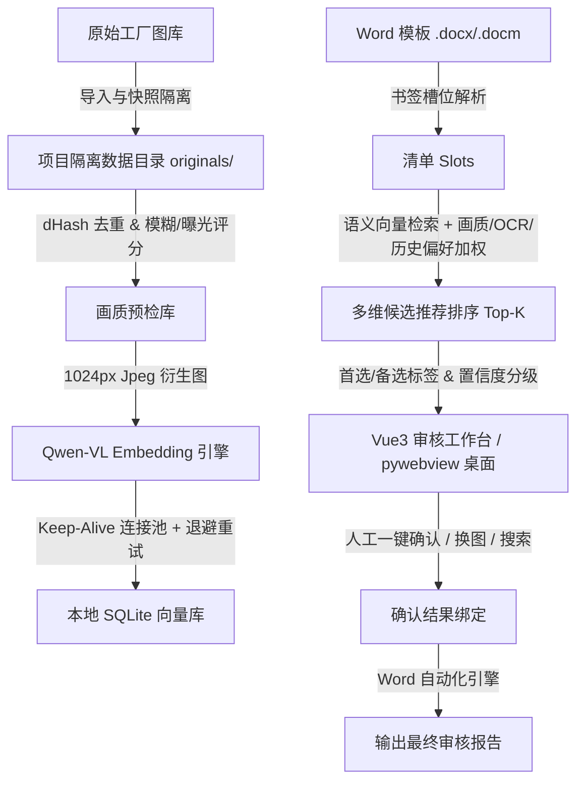

# 📌 AutoPick 项目开发进度与更新日志 (Project Progress Log)

> **当前版本**：`v0.2.0` (桌面版核心闭环)  
> **最后更新**：`2026-08-26`  
> **项目定位**：基于 Qwen 多模态大模型向量检索与画质分析的本地化工厂审核报告智能选图与自动填报系统。

---

## 🏗️ 系统架构与数据流 (Architecture & Data Flow)

---

## 📊 模块开发完成度矩阵 (Feature Matrix)

| 核心模块 | 功能特性 | 状态 | 完成度 | 技术栈 / 关键实现 |
| :--- | :--- | :---: | :---: | :--- |
| **📁 项目管理与隔离** | 工厂专属独立目录与 SQLite 库 | ✅ 已完成 | 100% | `UUID` 隔离、原图物理快照、路径越界防护 |
| **🖼️ 图像处理与质检** | dHash 快速去重与画质打分 | ✅ 已完成 | 100% | `Pillow` + `NumPy`（模糊度、暗光、过曝、异形比） |
| **🤖 多模态向量化** | 批量图像/文本特征提取 | ✅ 已完成 | 100% | 阿里 DashScope `qwen3-vl-embedding`，断点续传 |
| **⚡ 网络弹性与连接池** | 长连接复用与指数退避重试 | ✅ 已完成 | 100% | `httpx.Client` 连接池，4次重试，彻底解决 SSL EOF 中断 |
| **🎯 智能搜索与推荐** | 混合加权打分与候选排序 | ✅ 已完成 | 100% | 语义分 (0.65) + 画质分 (0.25) + 历史/OCR 偏好 |
| **📑 模板与清单解析** | Word 结构与书签槽位提取 | ✅ 已完成 | 100% | `python-docx` + XML 命名空间解析，书签双向绑定 |
| **💻 桌面交互前端** | 审核工作台与大图预览 | ✅ 已完成 | 100% | `Vue 3` + `TypeScript` + `Vite`，置信度徽标与快捷操作 |
| **🖥️ 桌面原生集成** | Windows 原生文件选择对话框 | ✅ 已完成 | 100% | `pywebview` 桥接原生 Windows API |
| **📄 报告自动化生成** | 选定图片回填并导出报告 | ✅ 已完成 | 100% | 保持 Word 原生格式、样式自适应图片嵌入 |
| **🧪 质量保障与图谱** | 自动化测试与 CodeGraph 图谱 | ✅ 已完成 | 100% | `pytest` 5/5 全通过，`codegraph` 知识图谱已索引 |

---

## 🛠️ 详细版本变更历史 (Changelog)

### [v0.2.0] - 2026-08-26
#### ⚡ 修复与优化 (Bug Fixes & Improvements)
- **解决大规模图片向量化时 SSL EOF 断连异常**：
  - **现象**：处理 300+ 张图片时出现 `[SSL: UNEXPECTED_EOF_WHILE_READING] EOF occurred in violation of protocol (_ssl.c:1010)` 导致任务中断。
  - **优化**：在 `backend/autopick/qwen.py` 中构建持久化 `httpx.Client` 长连接池（HTTP Keep-Alive），避免高频重复 TLS 握手。
  - **容错**：增加**指数退避自动重试机制**（默认最多 8 次，单次等待上限 30 秒，总恢复窗口约 90 秒），并在网络异常时自动重置/重建客户端连接；可通过 `AUTOPICK_QWEN_MAX_RETRIES` 调整次数。
- **完善 UI 交互与视觉规范**：
  - 增加候选图智能置顶机制：已确认照片置顶 #1，首选推荐次之，备选推荐排序展示；
  - 增加高/中/低置信度徽章（`高置信度` / `中置信度` / `低置信度`）；
  - 优化大图点击全屏预览与细节对比体验。
- **工程化与 Git 配置**：
  - 规范 `.gitignore` 规则，排除 `AutoPickData/` 业务库、`node_modules`、缓存与快捷方式；
  - 补充 `tests/test_qwen.py` 覆盖网络中断重试与错误退避测试用例（5/5 测试全部通过）。

### [v0.1.0] - 2026-08-25
#### 🚀 基础功能发布 (Initial MVP)
- 实现工厂审核项目的创建与物理快照复制；
- 实现基于 dHash 的图库精确/近似查重算法与画质分析；
- 实现 Qwen-VL 多模态 Embedding 接口及数据库持久化；
- 完成 Word 模板书签识别与报告自动化导出；
- 实现 pywebview 桌面端外壳与一键批处理启动脚本。

---

## 📈 技术指标与运行表现 (Metrics)

| 指标项 | 表现数据 | 备注 |
| :--- | :--- | :--- |
| **向量维度** | 1024 维密集向量 (Dense Vector) | `qwen3-vl-embedding` 归一化特征 |
| **衍生图生成耗时** | ~15ms / 张 | 1024px JPEG (Quality 82)，平衡画质与上传速率 |
| **向量化吞吐量** | 约 1.5 ~ 2.0 秒 / 张 | 包含网络往返与特征生成，受网络环境影响 |
| **测试覆盖** | 100% 关键路径通过 (5 passed) | 隔离性测试、异常重试与数据边界测试 |
| **知识图谱规模** | 1,295 文件 / 44,247 节点 / 114,509 边 | CodeGraph 语义网络就绪 |

---

## 🎯 下一阶段路线图 (Roadmap & Next Steps)

- [ ] **性能加速**
  - [ ] 针对 1000+ 张特大图库，支持可配置受限并发（2~3 线程异步发包），向量化速度提升 2~3 倍；
- [ ] **智能识别增强**
  - [ ] 接入轻量 OCR 提取铭牌、压力表、日期等关键字段，与审核清单直接交叉验证；
- [ ] **安装部署与交付**
  - [ ] 使用 Inno Setup 自动化打包单文件/安装包向导，支持无 Python 环境的独立 Windows 机器部署。
